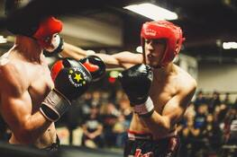

# pet-battle-nsff

Not Safe For Families image classifier for [pet battle app](http://github.com/petbattle)

Based on [Yahoo's Open NSFW Classifier](https://github.com/yahoo/open_nsfw) rewritten in tensorflow.

We are using a couple of the components in this repo:

- S3 minio to serve up a trained model
- Knative serverless eventing for calling tensorflow serving

Uses a Kubernetes deployment if knative not present in your cluster.

The full deployment based on the diagram below can be found [here](https://github.com/eformat/pet-battle-nsfw)


## Installing on OpenShift

Install using the helm3 chart.

If the `serverless-operator` is deployed in your cluster (separately) the helm chart will install a knative service for tfserving.
Else a Kubernetes deployment is used if no operator can be found.
```bash
oc new-project pet-battle-nsfw
helm repo add eformat https://petbattle.github.io/helm-charts
helm repo update
helm install pb-nsff petbattle/pet-battle-nsff --version=0.0.2
```

You may also want to try it along with the Pet Battle API
```bash
# openshift knative
HOST=$(kn service describe tensorflowserving-pb-nsff -o url)
# openshift deployment
HOST=$(oc get route tensorflowserving-pb-nsff -o custom-columns=ROUTE:.spec.host --no-headers)

helm install pb-api petbattle/pet-battle-api --version=1.0.8 --set nsff.enabled=true --set nsff.apiHost=${HOST}
```

## NSFF setup locally

Running in local containers using podman. You may need to adjust directories for your setup in the docker-compose.yaml file

Minio S3
```bash
cd minio
make podman-run
```
Create a bucket called `models`, login to http://localhost:9000 with default `minioadmin:miniadmin` credentials

Upload pre-built tensorflow model to minio
```bash
cd tensorflow-open_nsfw/tools
export MINIO_SERVICE_HOST=127.0.0.1:9000
export MINIO_ACCESS_KEY=minioadmin
export MINIO_SECRET_KEY=minioadmin
python3.7 s3uploader.py
```

Manually upload tfserving config to s3://models
```
cd tfserving
models.config
prometheus_config.config
```

Your minio should look like this:


Tensorflow Serving
```bash
./tf-run.sh
```

### NSFF Testing URLs

The model should be available from tfserving pod
```bash
# locally
HOST=http://localhost:8501/v1/models/test_model
# openshift knative
HOST=$(kn service describe tensorflowserving-pb-nsff -o url)/v1/models/test_model
# openshift deployment
HOST=https://$(oc get route tensorflowserving-pb-nsff -o custom-columns=ROUTE:.spec.host --no-headers)/v1/models/test_model

curl $HOST
{
 "model_version_status": [
  {
   "version": "1",
   "state": "AVAILABLE",
   "status": {
    "error_code": "OK",
    "error_message": ""
   }
  }
 ]
}
```

There are two test images

- `Safe For Families` - Daisy Cat


- `Not Safe For Families` - Wrestling



These have been base64 encoded and stashed in request files under the `requests` folder.

Test against tfserver locally:
```bash
# local
HOST=http://localhost:8501/v1/models/test_model:predict
# openshift knative
HOST=$(kn service describe tensorflowserving-pb-nsff -o url)/v1/models/test_model:predict
# openshift deployment
HOST=https://$(oc get route tensorflowserving-pb-nsff -o custom-columns=ROUTE:.spec.host --no-headers)/v1/models/test_model:predict

# Daisy Cat - Safe for Families
curl -s -k -H 'Content-Type: application/json' -H 'cache-control: no-cache' -H 'Accept: application/json' \
  -X POST --data-binary '@requests/tfserving/nsff-negative.json' $HOST
{
    "predictions": [[0.992712617, 0.00728740077]]
}

# Wrestling - Not Safe For Families
curl -s -k -H 'Content-Type: application/json' -H 'cache-control: no-cache' -H 'Accept: application/json' \
  -X POST --data-binary '@requests/tfserving/nsff-positive.json' $HOST
{
    "predictions": [[0.0139681576, 0.98603189]
}
```

The predictions array is composed of two scores `[ sff, nsff ]` - sff and nsff add to 1.

The higher the `sff` values the safer the image is for families.

### Test with Pet Battle API

You can test against [PetBattleAPI](https://github.com/petbattle/pet-battle-api) by uploading images directly to it.

Be sure to enable the `app.petbattle.nsff.enabled=true` flag in pet-battle-api and set the location of tfserving.

```bash
# local
HOST=http://localhost:8080/cats
# openshift
HOST=https://$(oc get route -l app.kubernetes.io/component=pet-battle-api -o custom-columns=ROUTE:.spec.host --no-headers)/cats

# Daisy Cat - Safe for Families
curl -X POST -H "content-type: application/json" --data-binary @requests/pet-battle-api/cat-nsff-negative.json $HOST

# Wrestling - Not Safe For Families
curl -X POST -H "content-type: application/json" --data-binary @requests/pet-battle-api/cat-nsff-positive.json $HOST
```

### Knative using cli

You can also manually deploy the knative service using `kn` cli as long as you have minio deployed with the model
```bash
kn service create tensorflowserving-pb-nsff \
  --image=docker.io/tensorflow/serving:latest \
  --cmd "tensorflow_model_server" \
  --arg "--model_config_file=s3://models/models.config" \
  --arg "--monitoring_config_file=s3://models/prometheus_config.config" \
  --arg "--rest_api_port=8501" \
  --env S3_LOCATION=minio-pb-nsff:9000 \
  --env AWS_ACCESS_KEY_ID=minio \
  --env AWS_SECRET_ACCESS_KEY=minio123 \
  --env AWS_REGION=us-east-1 \
  --env S3_REGION=us-east-1 \
  --env S3_ENDPOINT=minio-pb-nsff:9000 \
  --env S3_USE_HTTPS="0" \
  --env S3_VERIFY_SSL="0" \
  --env AWS_LOG_LEVEL="3" \
  --port 8501 \
  --autoscale-window "120s"
```
